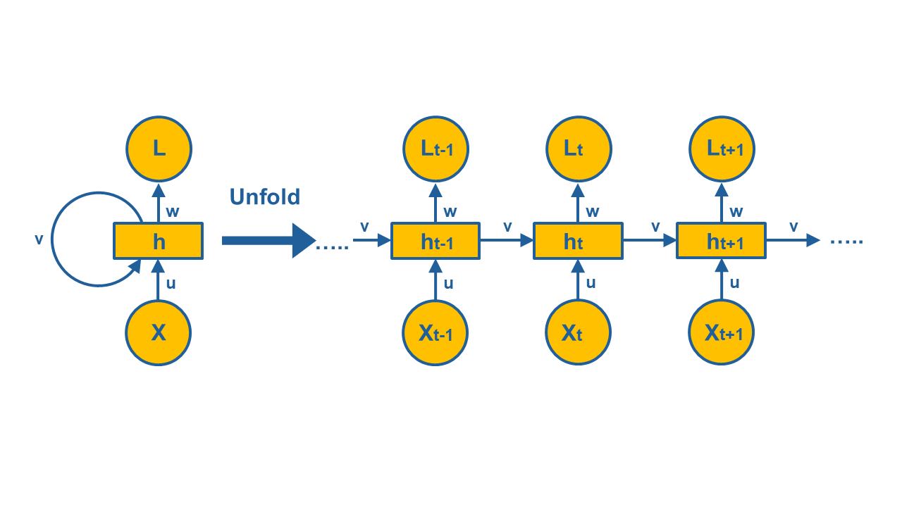
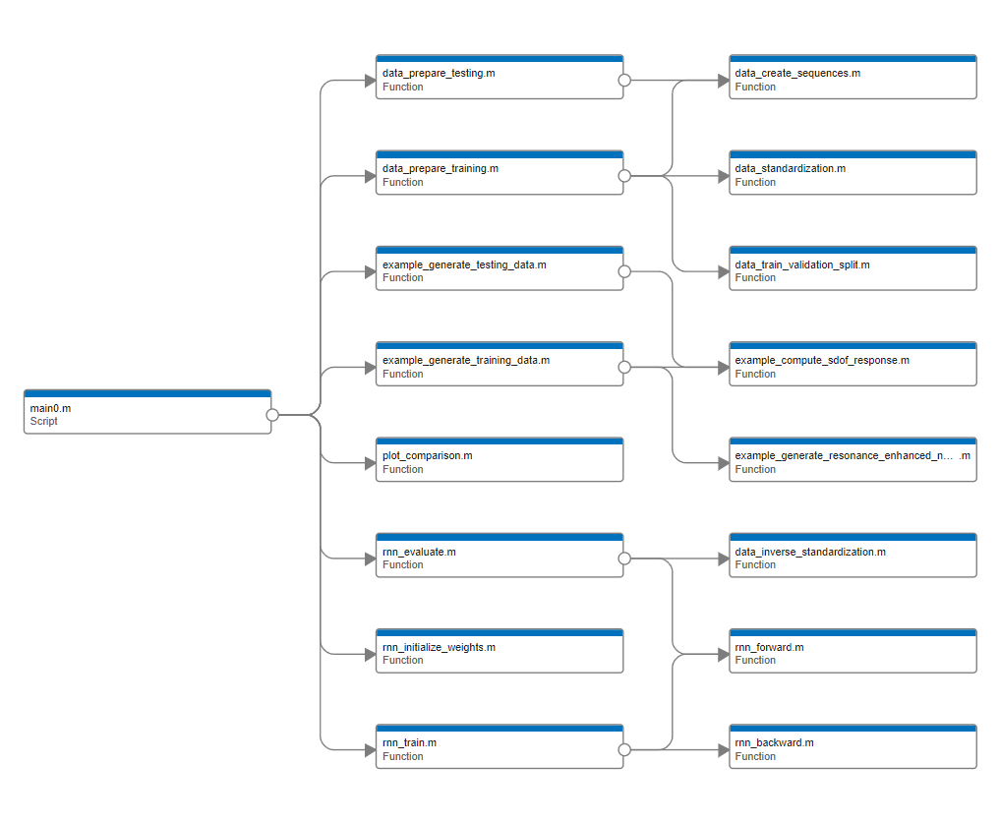
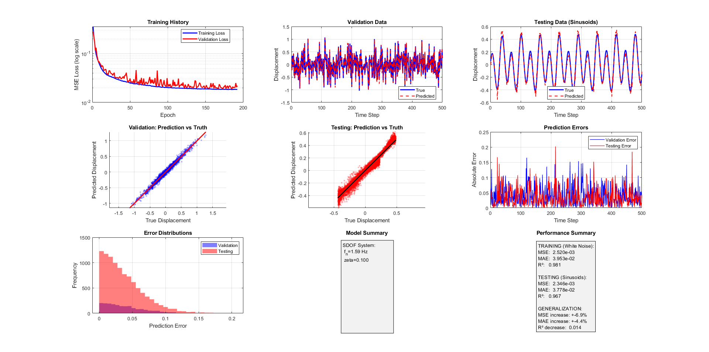

## Sequence to Sequence Recurrent Neural Network with BackPropagation Through Time (BPTT)



This MATLAB project provides a complete, from-scratch implementation of a Recurrent Neural Network (RNN) with Backpropagation Through Time (BPTT) as a sequence learning method, for prediction of the time history of the dynamic response (output) of a SDOF oscillator excited by a given excitation time history (input). The RNN accepts a dynamic excitation time history and returns the response of a Single Degree of Freedom (SDOF) oscillator to this excitation. For this purpose it is trained using an amplification-enhanced white noise excitation, which includes a wide range of frequency content which is seen by the RNN during training. After training, the prediction of the RNN to a linear combination of sinusoidal time histories is tested. Successful agreement exists between the dynamic response of the SDOF oscillator predicted by the RNN and calculated rigorously using the Newmark time integration algorithm. The present implementation demonstrates fundamental deep learning concepts through a practical application: predicting the dynamic response of physical systems at a given excitation time history, while the code can be easily modified to predict the solution of any differential equation. A similar job for seismic dynamic response prediction of a slope system is presented in reference [3].

No MATLAB toolbox is required to run this code, which is particularly useful for educational NN prototypes or if you want  fine-grained control over weight updates, learning rate, activation functions, etc. No dependencies on MATLAB’s Deep Learning Toolbox or any other toolboxes exist, therefore:
- It can run on any MATLAB version
- It can be translated easily to other languages (Python, JavaScript, etc.) either manually or through a LLM model or AI assistant (ChatGPT, Gemini, DeepSeek, etc.).
- It can be easily adapted to other coding environments (e.g. GNU Octave)
- Finally, it is transparent and  easy to extend (ideal for NN research and learning). 

The local functions used in this script are classified into three categories:
- functions that are used for data processing (their names begin with "data_...")
- functions that are part of the RNN model (their names begin with "rnn_...")
- functions that are used as part of the SDOF oscillator example (their names begin with "example_..."). 
The functions of this category can be modified to accomodate for any sequence-to-sequence prediction problem which can be solved by this code.

This code serves as a foundational educational tool for understanding RNN internals while providing a robust framework for practical time series prediction tasks. The focus on algorithmic transparency makes it ideal for teaching, research prototyping, and understanding the fundamentals of recurrent neural networks.

Note: The results produced by the code may vary given the stochastic nature of the algorithm or evaluation procedure, or differences in numerical precision. For consistency purposes and without loss of generality, the random number generator is appropriately initialized at the beginning of the code. If this option is removed, consider running the example a few times and compare the average outcome.

## Core Algorithmic Features
    
* Backpropagation Through Time (BPTT): Full implementation with gradient clipping and truncated backpropagation
* Memory-Efficient Forward Pass: Optimized state management for sequential processing
* Gradient Descent Optimization: Custom learning rate scheduling
* Numerical Stability Mechanisms: Gradient clipping, weight scaling, and bias initialization
* Dynamic Windowed BPTT: Configurable backpropagation depth to balance memory and gradient flow
* Self-Contained Implementation: No deep learning toolbox dependencies

## Prerequisites

* No Additional Toolboxes Required: Pure MATLAB based implementation

## Quick Start

* Clone or download the repository
* Navigate to the project directory in MATLAB
* Run the main script (main.m)

## Dependency graph



## Algorithmic Details

* Forward Propagation (rnn_forward)

1. Stateful Computation: Maintains hidden state across sequence
2. Activation: tanh for hidden states, linear for outputs

* Backpropagation Through Time (rnn_backward)

1. Truncated BPTT: Limits gradient flow to configurable window
2. Gradient Clipping: Prevents exploding gradients
3. Efficient Computation: Matrix operations for batch gradients
4. Numerical Stability: Safe gradient accumulation

* Training Algorithm (rnn_train)

1. Mini-batch Gradient Descent: Configurable batch sizes
2. Learning Rate Decay: Exponential decay after initial epochs
3. Early Stopping: Patience-based validation monitoring
4. Gradient Clipping: L2 norm clipping at 1.0

* Loss Computation

1. Mean Squared Error (MSE) objective
2. Regularization: Implicit through gradient clipping

* Data Processing Pipeline

1. Sequence Generation (data_create_sequences)
    1. Sliding Window Approach: Creates overlapping sequences
    2. Configurable Length: Variable sequence memory
    3. Batch Alignment: Ensures consistent sequence dimensions
2. Normalization (data_standardization)
    1. Z-score Standardization: Zero mean, unit variance
    2. Parameter Preservation: Stores statistics for inverse transformation
    3. Consistent Scaling: Applies same transformation to train/test data

## Advanced Features

* Mechanisms to control gradient flow:

1. Truncated BPTT (in rnn_backward)
2. Gradient Clipping (norm-based)
3. Learning Rate Scheduling (in rnn_train)

* Memory Optimization

1. Batch processing instead of full dataset
2. Selective storage of hidden states needed for BPTT
3. In-place operations where possible
4. Efficient sequence generation without data duplication

## Algorithm Flowchart

``` 
Start
  ↓
Initialize Parameters
  ├── RNN: hidden_units, sequence_length
  ├── Training: learning_rate, batch_size
  └── Example SDOF system: m, k, c, dt
  ↓
Generate Training Data
  ├── Generate white noise excitation
  └── Calculate SDOF response to white noise (Newmark-beta)
  ↓
Preprocess Training Data
  ├── Create sequences
  ├── Normalize (z-score)
  └── Split train/val
  ↓
Initialize RNN Weights
  ├── W1, W2, W3
  └── b1, b2
  ↓
Training Loop (for each epoch)
  ├── Shuffle batches
  ├── Forward pass → Predictions
  ├── Compute MSE loss
  ├── BPTT (Backpropagation Through Time)
      ├── Gradient computation
      ├── Gradient clipping
      ├── Weight updates
  ├── Validation check
  └── Early stopping?
      ├── No → Continue
      └── Yes → Break
  ↓
Generate Testing Data
  ├── Generate linear combination of sinusoids
  └── Calculate SDOF response to the above (Newmark-beta)
  ↓
Preprocess Testing Data
  ├── Create sequences
  └── Normalize (z-score)
  ↓
Evaluation
  ├── Make predictions
  ├── Inverse normalization (z-score)
  └── Compute metrics (MSE, MAE, R²)
  ↓
Visualize results
  ↓
End 
```

## Results



## Customization Guide
* Modifying Network Architecture

1. Change hidden layer size
2. Modify activation functions
3. Add additional hidden layers

* Implementing Different BPTT Strategies

- Modify rnn_backward for different BPTT variants:

1. Full BPTT (backpropagate through entire sequence). Remove window_length limitation
2. Randomized Truncation
3. Adaptive Truncation (increases with training)

* Adding Regularization

1. L2 Regularization
2. Dropout
3. Gradient Noise

## Applications and Extensions
* Time Series Forecasting

1. Adapt for financial, weather, or sensor data
2. Sequence Classification

## Troubleshooting and Debugging
Common Issues and Solutions

* Solutions implemented for vanishing/Exploding Gradients

1. Gradient clipping
2. Tanh activation (saturating but less than sigmoid)
3. Weight initialization scaling (decrease the scaling factor)
4. Truncated BPTT (window_length parameter)

* Possible fixes for slow Convergence

1. Increase learning rate
2. Increase model capacity (hidden layer size)
3. Reduce sequence length
4. Increase batch size

* Strategies for mitigation of overfitting

1. Increase validation split
2. Reduce patience (more aggressive early stopping)
3. Add L2 regularization

## License
See LICENSE.

## Contributing
We welcome contributions! Areas of particular interest:

- Additional RNN variants (LSTM, GRU implementations)
- Advanced optimization algorithms
- Additional application examples
- Performance benchmarking tools

Please see [CONTRIBUTING.md](https://contributing.md/) for guidelines.

## Support
For questions, issues, or feature requests either open an issue on GitHub Issues or contact me directly through email at gpapazafeiropoulos@yahoo.gr

## References

1. **Backpropagation Through Time (BPTT)** 

Werbos, P. J. (2002). Backpropagation through time: what it does and how to do it. Proceedings of the IEEE, 78(10), 1550-1560.

2. **RNN Training Challenges** 

Bengio, Y., Simard, P., & Frasconi, P. (1994). Learning long-term dependencies with gradient descent is difficult. IEEE transactions on neural networks, 5(2), 157-166.

3. **Dynamic Response Prediction using RNNs**

Huang, Y., Han, X., & Zhao, L. (2021). Recurrent neural networks for complicated seismic dynamic response prediction of a slope system. Engineering Geology, 289, 106198.
